# Technical Test – Shift Engineer DevOps
**PT Simple Journey Indonesia**

Sebuah Go HTTP server kecil dibawa dari kode sumber → dibungkus menjadi Docker image minimal (±2 MB) → di-*hotfix* di server yang sedang hidup tanpa `docker build` ulang → dikirim otomatis oleh pipeline Jenkins → seluruh infrastrukturnya dibangun di AWS dengan Terraform.

| Item | Detail |
|---|---|
| **Versi Go** | 1.22 (builder `golang:1.22-alpine`; Go 1.22.10 di server Jenkins) |
| **Base image final** | `scratch` (kosong, 0 MB) |
| **Container runtime** | Docker Engine (Ubuntu 22.04) |
| **CI/CD** | Jenkins LTS + Pipeline (Jenkinsfile di `cicd/`) |
| **Infrastruktur** | AWS `ap-southeast-1` – 2× EC2, dibuat dengan Terraform |
| **Aplikasi** | `GET /` → `Hello, DevOps! version=<versi build>` |

## Daftar Isi
- [Struktur Repo](#struktur-repo)
- [Arsitektur](#arsitektur)
- [Langkah 0 – Persiapan Mesin Uji](#langkah-0--persiapan-mesin-uji)
- [Bagian I – Build (Pembuatan Docker Image)](#bagian-i--build-pembuatan-docker-image)
- [Bagian II – Deploy & Skenario Hotfix](#bagian-ii--deploy--skenario-hotfix)
- [Bagian III – CI/CD dengan Jenkins](#bagian-iii--cicd-dengan-jenkins)
- [Dokumen Lain](#dokumen-lain)

## Struktur Repo

```
.
├── app/                    # Aplikasi Go (website)
│   ├── main.go, main_test.go, go.mod
│   ├── Dockerfile, .dockerignore
│   └── scripts/            # build.sh, run.sh, hotfix-swap.sh, demo-swap.sh
├── cicd/                   # Jenkinsfile + scripts/deploy.sh
├── infra/
│   ├── terraform/          # VPC, SG, key pair, 2× EC2, Elastic IP
│   └── scripts/            # user-data: install Docker, Go, Java, Jenkins
├── docs/                   # SETUP-GUIDE.md (langkah lengkap), TROUBLESHOOTING.md
└── image/                  # SEMUA screenshot bukti (dipanggil dari README ini)
```

## Arsitektur


Dua EC2 berada di satu VPC (`10.20.0.0/16`). **Jenkins Server** menjadi orkestrator CI/CD (checkout, test, build image, ekstrak binary), sedangkan **App Server** adalah target produksi yang hanya menjalankan Docker dan menampung container `hello-devops` di port 8080. Jenkins masuk ke App Server lewat SSH menggunakan key dari *Jenkins Credentials*. Detail pembuatan infrastruktur: [`docs/SETUP-GUIDE.md`](docs/SETUP-GUIDE.md).

---

## Langkah 0 – Persiapan Mesin Uji

Bagian I dan II dikerjakan di sebuah mesin Linux (di sini: **VM Ubuntu Server** / bisa juga EC2 App Server) yang **hanya memiliki Docker** — ini sekaligus bukti syarat *"image harus jalan tanpa Go toolchain di host"*.

```bash
# 1. Pasang Docker (jika belum ada)
curl -fsSL https://get.docker.com | sudo sh
sudo systemctl enable --now docker
docker --version

# 2. Ambil source code
git clone https://github.com/kanjeeng/devops-technical-test-jenkins.git
cd devops-technical-test-jenkins/app

# 3. Buktikan Go TIDAK terpasang di host
which go || echo "Go tidak terpasang di host"
```

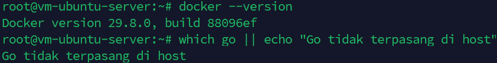

---

## Bagian I – Build (Pembuatan Docker Image)

### 1. Penjelasan Langkah-Langkah & Implementasi Teknis

Setiap syarat di soal dipetakan ke satu keputusan teknis berikut:

| Syarat soal | Keputusan | Di mana |
|---|---|---|
| Multi-stage Dockerfile | 2 stage: `builder` (kompilasi) dan runtime (hanya binary) | `app/Dockerfile` |
| Binary *statically linked* | `CGO_ENABLED=0` | stage builder |
| Base image final sekecil mungkin | `scratch` | stage runtime |
| Versi bisa di-inject saat build | `-ldflags "-X main.version=${VERSION}"` + `--build-arg` | stage builder |
| Jalan tanpa Go di host | kompilasi terjadi di dalam container builder | seluruh Dockerfile |

#### A. Dockerfile dengan *Multi-Stage Build*

Dockerfile dibagi dua tahap supaya **alat kompilasi tidak ikut terbawa ke produksi**. Stage pertama adalah "dapur" (lengkap dengan compiler Go), stage kedua adalah "piring saji" (hanya hasil masakan jadi).

- **Tahap 1 – `golang:1.22-alpine` (builder):** meng-*download* modul dan mengompilasi kode. `CGO_ENABLED=0` mematikan CGO sehingga hasilnya *statically linked binary*: satu berkas mandiri yang tidak memerlukan `libc` atau *shared library* dari OS mana pun.
- **Tahap 2 – `scratch` (runtime):** image kosong. Hanya satu berkas, binary hasil tahap 1, yang disalin masuk.

```dockerfile
# --- Stage 1: builder ---
FROM golang:${GO_VERSION}-alpine AS builder
...
# --- Stage 2: runtime (minimal) ---
FROM scratch
COPY --from=builder /out/server /app/bin/server
```

#### B. Injeksi Versi saat Build (`-ldflags`)

Di `main.go`, versi hanyalah sebuah variabel yang nilai awalnya `dev`:

```go
var version = "dev"   // ditimpa saat build lewat -ldflags
```

Saat kompilasi, nilainya ditimpa tanpa mengubah kode sumber sama sekali:

```dockerfile
ARG VERSION=dev
RUN CGO_ENABLED=0 GOOS=linux \
    go build -trimpath \
      -ldflags="-s -w -X main.version=${VERSION}" \
      -o /out/server .
```

| Flag | Fungsi |
|---|---|
| `-X main.version=${VERSION}` | Menyisipkan nilai `--build-arg VERSION` (mis. `1.0.0`) ke variabel `main.version`, sehingga `GET /` menampilkan versi build tersebut |
| `-s -w` | Membuang *symbol table* dan info *debug* → binary lebih kecil |
| `-trimpath` | Menghapus path mesin build dari binary → build lebih *reproducible* |

#### C. Berjalan Tanpa Go Toolchain di Host

Seluruh kompilasi terjadi di dalam container `builder`, sehingga host cukup memiliki Docker. Container akhir (`scratch`) langsung menjalankan binary secara mandiri. Selain itu image dijalankan sebagai **non-root** (`USER 65534:65534`) dan membawa `HEALTHCHECK` berbasis binary itu sendiri (karena `scratch` tidak punya `curl`/`wget`).

```dockerfile
USER 65534:65534
HEALTHCHECK --interval=10s --timeout=3s --start-period=3s --retries=3 \
  CMD ["/app/bin/server", "-healthcheck"]
ENTRYPOINT ["/app/bin/server"]
```

> 💡 Binary ditaruh di direktori khusus `/app/bin/`, bukan langsung di `/`. Ini keputusan desain yang dipakai di Bagian II: **direktori** itulah yang nanti di-*mount* dari host agar binary bisa diganti tanpa membangun ulang image.

### 2. Deliverables Bagian I

#### A. Dockerfile
Berkas lengkap: [`app/Dockerfile`](app/Dockerfile). Potongan terpenting sudah ditampilkan di bagian 1A–1C di atas.

Cuplikan tahap kompilasi sebagaimana tertulis di Dockerfile:

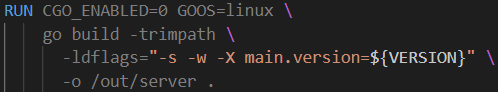

#### B. Perintah Build yang Digunakan

```bash
cd ~/devops-technical-test-jenkins/app
docker build --build-arg VERSION=1.0.0 -t hello-devops:1.0.0 .
```

- `--build-arg VERSION=1.0.0` → nilai yang masuk ke `-X main.version=...`
- `-t hello-devops:1.0.0` → nama dan tag image
- `.` → konteks build adalah folder `app/`

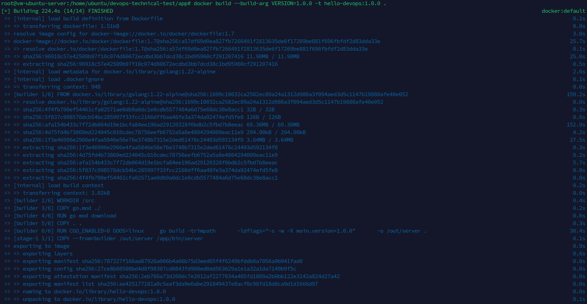

#### C. Ukuran Image Final & Penjelasannya

```bash
docker images hello-devops
```

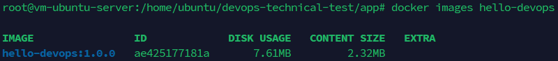

| Metrik | Nilai |
|---|---|
| **Content Size** (ukuran terkompresi, yang dikirim saat push/pull) | **2,32 MB** |
| **Disk Usage** (ruang di disk) | **7,61 MB** |
| Ukuran binary mentah (hasil ekstraksi, lihat bagian 3) | 5,28 MB |

**Mengapa sekecil ini?**
1. **Base image `scratch` = 0 MB.** Tidak ada OS, shell, maupun *package manager*; satu-satunya isi image hanyalah satu berkas binary Go.
2. **Optimasi Binary Go.** Flag `-s -w` membuang symbol table dan info debug, dan `CGO_ENABLED=0` membuatnya mandiri sehingga tidak perlu menyertakan library apa pun.
3. **Korelasi Metrik Ukuran.** Binary mentah berukuran 5,28 MB terkompresi menjadi ±2,32 MB (*Content Size*). Angka *Disk Usage* sebesar 7,61 MB (≈ 5,28 MB + 2,32 MB) terjadi karena Docker (khususnya yang menggunakan *containerd image store*)menyimpan dua bentuk data di disk lokal: berkas arsip layer terkompresi **dan** filesystem hasil ekstraksinya.
4. **Bonus keamanan:** tanpa paket OS, *attack surface* minimal dan tidak ada paket yang bisa terkena CVE.

**Kenapa `scratch` dan bukan `alpine`/`distroless`?** Karena binary-nya sudah *static*, tidak ada yang perlu disediakan OS. `alpine` (±8 MB) membawa shell dan paket yang tidak terpakai; `distroless` baru lebih masuk akal bila aplikasi butuh sertifikat CA / zona waktu. *Trade-off* `scratch`: tidak ada shell untuk `docker exec`, sehingga pengujian dilakukan lewat `docker logs` dan binary yang diekstrak ke host (bagian 3).

### 3. Bukti Verifikasi Tambahan (*Statically Linked Binary*)

Karena `scratch` tidak punya shell maupun `ldd`, binary **diekstrak keluar** dari image ke host lalu diperiksa di sana.

```bash
# Ekstrak binary dari image tanpa menjalankannya
cid=$(docker create hello-devops:1.0.0) && docker cp $cid:/app/bin/server /tmp/server && docker rm $cid
```

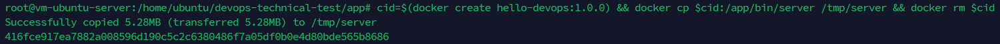

```bash
# Periksa tipe berkas dan ketergantungan library
file /tmp/server
ldd /tmp/server
```

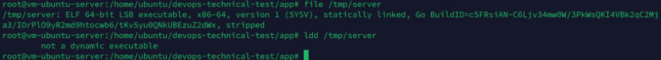

**Kesimpulan:** `file` melaporkan *statically linked* dan *stripped*, sedangkan `ldd` menjawab `not a dynamic executable`. Artinya binary berdiri sendiri tanpa ketergantungan pada *shared library* OS pembuatnya.

### 4. Bukti Image Berjalan Tanpa Go di Host (*Smoke Test*)

Memakai port sementara `18080` agar tidak bentrok dengan Bagian II:

```bash
docker run -d --rm --name smoke -p 18080:8080 hello-devops:1.0.0
curl -s http://localhost:18080/
docker stop smoke
```

Hasil yang diharapkan: `Hello, DevOps! version=1.0.0`.

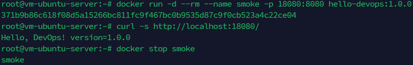

---

## Bagian II – Deploy & Skenario Hotfix

### 1. Menyiapkan Direktori Host & Menjalankan Container Pertama Kali

Image `scratch` sengaja dirancang agar binary-nya bisa diganti dari luar. Karena itu binary versi 1.0.0 **diekstrak dari image ke host** terlebih dahulu, lalu direktorinya di-*bind mount* ke container (read-only) dengan kebijakan *restart* otomatis.

```bash
# 1. Buat direktori di host
sudo mkdir -p /opt/hello-devops/bin

# 2. Ekstrak binary v1.0.0 dari image ke host
cid=$(docker create hello-devops:1.0.0)
sudo docker cp $cid:/app/bin/server /opt/hello-devops/bin/server
docker rm $cid
sudo chmod 0755 /opt/hello-devops/bin/server

# 3. Jalankan container: port 8080 ke host, restart policy, bind-mount read-only
docker run -d \
  --name hello-devops \
  --restart unless-stopped \
  -p 8080:8080 \
  -v /opt/hello-devops/bin:/app/bin:ro \
  hello-devops:1.0.0
```

Verifikasi container hidup, port ter-*expose*, dan restart policy tercatat:

```bash
docker ps --filter name=hello-devops
docker inspect -f 'RestartPolicy: {{.HostConfig.RestartPolicy.Name}}' hello-devops
```

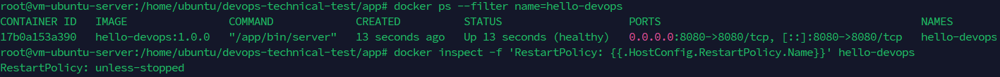

| Opsi | Arti | Dipakai? |
|---|---|---|
| `-p 8080:8080` | Port 8080 container dibuka ke port 8080 host | ✅ syarat soal butir 4 |
| `--restart unless-stopped` | Hidup lagi otomatis saat **crash** *dan* saat host/Docker reboot; berhenti hanya jika dimatikan manual | ✅ dipilih |
| `-v …/bin:/app/bin:ro` | Direktori host menimpa `/app/bin` di container, read-only | ✅ kunci skenario hotfix |

> **Kenapa mount *direktori*, bukan satu file?** Saat sebuah file diganti lewat `mv`, ia mendapat *inode* baru. Bind-mount satu file bisa tetap menunjuk inode lama. Dengan me-mount direktori, container selalu melihat isi terbaru direktori itu setiap kali proses dimulai.

#### Bukti *restart policy* bekerja (simulasi crash)

Soal meminta container hidup lagi setelah crash. Proses utama dibunuh paksa dari luar (setara crash), lalu dilihat Docker menghidupkannya kembali:

```bash
# Catat PID proses di dalam container, lalu bunuh paksa (SIGKILL)
PID=$(docker inspect -f '{{.State.Pid}}' hello-devops)
sudo kill -9 $PID

# Tunggu sebentar, lalu cek: container Up lagi dan RestartCount bertambah
sleep 3
docker ps --filter name=hello-devops
docker inspect -f 'RestartCount: {{.RestartCount}}' hello-devops
curl -s http://localhost:8080/
```

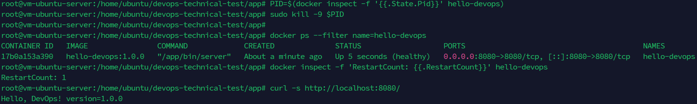

### 2. Verifikasi Aplikasi Sebelum Swap (Before)

Pastikan aplikasi berjalan di versi **1.0.0**, dan catat **ID container** serta **ID image**. Dua ID ini adalah "sidik jari" yang nanti harus **tetap sama** setelah hotfix — pembuktian bahwa tidak ada container yang dibuat ulang dan tidak ada image yang di-*build* ulang.

```bash
curl -s http://localhost:8080/
docker inspect -f 'Container ID: {{.Id}}' hello-devops | cut -c1-26
docker inspect -f 'Image ID: {{.Image}}' hello-devops | cut -c1-22
```

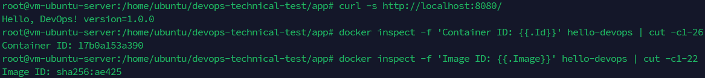

**Opsional – pasang "alat ukur downtime".** Buka terminal kedua dan biarkan berjalan sepanjang langkah 4–5. Setiap 0,2 detik ia memanggil aplikasi dan mencatat kode HTTP-nya (`200` = hidup, `000` = mati):

```bash
while true; do
  printf '%s ' "$(date +%T.%3N)"
  curl -s -m 1 -o /dev/null -w '%{http_code}\n' http://localhost:8080/ || true
  sleep 0.2
done
```

### 3. Simulasi *Bug Fix*: Kompilasi Binary Versi 1.0.1

Anggap sebuah *bug fix* selesai dan versi baru bernomor **1.0.1** harus segera naik. Binary baru dikompilasi memakai container Go **sementara** — ini bukan `docker build` dan image utama tidak disentuh.

```bash
cd ~/devops-technical-test-jenkins/app
mkdir -p dist

docker run --rm -v "$PWD":/src -w /src -e CGO_ENABLED=0 golang:1.22-alpine \
  go build -trimpath -ldflags="-s -w -X main.version=1.0.1" -o dist/server-1.0.1 .

ls -lh dist/
```

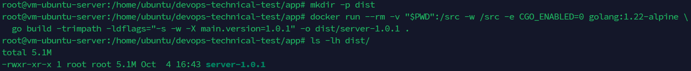

**Penjelasan perintah:**

| Bagian | Fungsi |
|---|---|
| `mkdir -p dist` | Folder penampung sementara hasil kompilasi (`app/dist/`) |
| `docker run --rm` | Meminjam toolchain Go secara *ephemeral*; container dihapus otomatis setelah selesai |
| `-v "$PWD":/src -w /src` | Menghubungkan folder `app/` host ke `/src` di container dan menjadikannya direktori kerja |
| `-e CGO_ENABLED=0` | Menjamin hasilnya *static*, sama seperti di Bagian I |
| `-ldflags="… -X main.version=1.0.1"` | Menimpa variabel versi menjadi `1.0.1` |
| `-o dist/server-1.0.1` | Menyimpan hasil ke host: `app/dist/server-1.0.1` |

**Hasil:** binary 1.0.1 kini ada di host, sementara container `hello-devops` (versi 1.0.0) **tetap hidup tanpa terganggu**.

### 4. Eksekusi Hotfix Swap & Restart Container

Tiga langkah manual berikut juga sudah dibungkus dalam skrip `./scripts/hotfix-swap.sh dist/server-1.0.1 1.0.1` (lengkap dengan *health check* dan *rollback* otomatis).

#### 4.1 Mencadangkan binary lama (`cp -a`)

```bash
sudo cp -a /opt/hello-devops/bin/server /opt/hello-devops/bin/.server.previous
```

`-a` (*archive*) menyalin binary beserta seluruh atributnya (izin, pemilik, timestamp). Berkas cadangan ini adalah **jaring pengaman**: bila 1.0.1 ternyata bermasalah, kembali ke versi sebelumnya cukup satu `mv` + restart tanpa mencari-cari kode lama.

#### 4.2 Mengganti binary secara atomik (`install` + `mv`)

```bash
sudo install -m 0755 dist/server-1.0.1 /opt/hello-devops/bin/.server.new
sudo mv -f /opt/hello-devops/bin/.server.new /opt/hello-devops/bin/server
```

Kenapa tidak langsung `cp dist/server-1.0.1 /opt/hello-devops/bin/server`? Karena `cp` menulis bertahap; bila container membaca binary di tengah penulisan, ia mendapat berkas setengah jadi (*partial write*) → gagal eksekusi/crash. Solusinya dua tahap:
1. `install` menaruh binary baru lengkap dengan izin `0755` ke **nama sementara** `.server.new` di direktori yang sama.
2. `mv -f` melakukan *rename*. Pada filesystem yang sama, `rename` bersifat **atomik**: nama `server` langsung menunjuk binary lama atau binary baru, tidak pernah berada di kondisi tengah-tengah.

#### 4.3 Restart container (bukan *recreate*)

```bash
time docker restart -t 5 hello-devops
```

`docker restart` mengirim `SIGTERM` (bukan mematikan paksa) sehingga aplikasi Go menutup server dengan rapi; `-t 5` memberi batas 5 detik sebelum `SIGKILL`. Container **tidak dihapus** dan image **tidak dibangun ulang**: Docker hanya menghentikan proses lama di container yang sama lalu menjalankannya lagi, dan proses baru memuat binary dari `/app/bin/server` yang kini sudah versi 1.0.1. Total waktu restart ±1–2 detik.

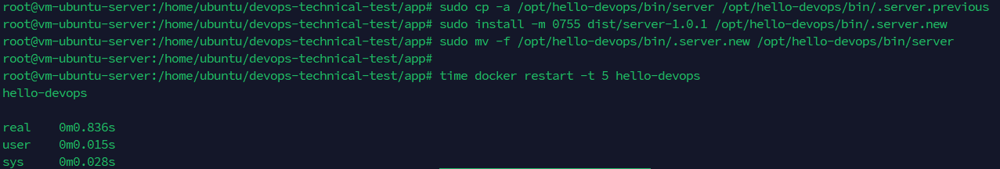

### 5. Verifikasi Aplikasi Sesudah Swap (After)

```bash
curl -s http://localhost:8080/
docker inspect -f 'Container ID: {{.Id}}' hello-devops | cut -c1-26
docker inspect -f 'Image ID: {{.Image}}' hello-devops | cut -c1-22
```

Harapannya: respons berubah menjadi **`version=1.0.1`**, sedangkan Container ID dan Image ID **sama persis** dengan sebelum swap.

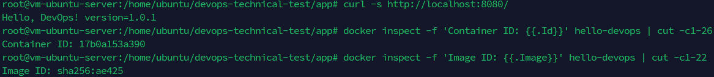

Bila alat ukur downtime dari langkah 2 dipasang, hentikan dengan `Ctrl+C` dan lihat berapa baris `000` yang muncul (setiap baris ≈ 0,2 detik):

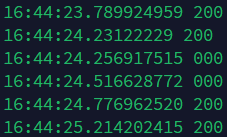

#### Opsional – Demo *rollback* manual

```bash
# 1. Salin binary cadangan (.server.previous) ke berkas sementara
sudo install -m 0755 /opt/hello-devops/bin/.server.previous /opt/hello-devops/bin/.server.rollback

# 2. Swap secara atomik menggunakan mv (bukan cp)
sudo mv -f /opt/hello-devops/bin/.server.rollback /opt/hello-devops/bin/server

# 3. Restart container agar memuat binary v1.0.0 hasil rollback
docker restart -t 5 hello-devops

# 4. Verifikasi (respons kembali ke versi 1.0.0)
curl -s http://localhost:8080/
```

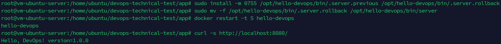

> Setelah demo rollback, ulangi langkah 4.2–4.3 bila ingin kembali ke 1.0.1.

### 6. Deliverables Bagian II

**a. Semua perintah yang digunakan**

| Tahap | Perintah |
|---|---|
| Siapkan direktori | `sudo mkdir -p /opt/hello-devops/bin` |
| Ekstrak binary awal | `cid=$(docker create hello-devops:1.0.0)` · `sudo docker cp $cid:/app/bin/server /opt/hello-devops/bin/server` · `docker rm $cid` · `sudo chmod 0755 /opt/hello-devops/bin/server` |
| Run | `docker run -d --name hello-devops --restart unless-stopped -p 8080:8080 -v /opt/hello-devops/bin:/app/bin:ro hello-devops:1.0.0` |
| Build binary 1.0.1 | `docker run --rm -v "$PWD":/src -w /src -e CGO_ENABLED=0 golang:1.22-alpine go build -trimpath -ldflags="-s -w -X main.version=1.0.1" -o dist/server-1.0.1 .` |
| Backup | `sudo cp -a /opt/hello-devops/bin/server /opt/hello-devops/bin/.server.previous` |
| Swap atomik | `sudo install -m 0755 dist/server-1.0.1 /opt/hello-devops/bin/.server.new` · `sudo mv -f /opt/hello-devops/bin/.server.new /opt/hello-devops/bin/server` |
| Restart | `docker restart -t 5 hello-devops` |

**b. Output `curl` sebelum dan sesudah swap**

```text
# SEBELUM
$ curl -s http://localhost:8080/
Hello, DevOps! version=1.0.0

# SESUDAH
$ curl -s http://localhost:8080/
Hello, DevOps! version=1.0.1
```

(Screenshot: `image/bagian2-03-before-swap.png` dan `image/bagian2-06-after-swap.png`.)

**c. Penjelasan singkat – pendekatan yang dipilih dan alasannya**

Pendekatan yang dipilih adalah **me-mount direktori binary dari host** (opsi kedua di soal), lalu mengganti file di host dan me-*restart* container yang sama. Image tetap *immutable* dan container tidak pernah dihapus, sehingga hotfix hanya butuh ±1–2 detik tanpa menunggu `docker build` maupun *pull* layer. Penggantian berkas memakai `install` + `mv` (atomik) dan binary lama selalu tersimpan di `.server.previous`, sehingga hotfix aman dan *rollback* hanya satu perintah. Cocok untuk skenario hotfix produksi karena cepat, kecil risikonya, dan dapat diulang oleh skrip maupun pipeline. Catatan jujurnya: selama restart tetap ada jeda singkat karena hanya ada satu instance; untuk *zero downtime* perlu dua replika di belakang load balancer.

**d. Perbandingan tiga pendekatan (trade-off)**

| Pendekatan | Kelebihan | Kekurangan |
|---|---|---|
| `docker cp` ke container + restart | Paling sederhana, tidak perlu mount | Perubahan hilang bila container dibuat ulang; isi container menyimpang dari image |
| **Mount direktori binary (dipilih)** | Image immutable, swap = ganti file, mudah di-rollback & diotomasi | Binary di host bisa "menyimpang" dari image bila tidak dikontrol (diatasi dengan mengambil binary dari image hasil build CI) |
| Sidecar/init container + shared volume | Rapi dan mudah diaudit, cocok di Kubernetes | Lebih kompleks untuk satu host; butuh orkestrasi tambahan |

---

## Bagian III – CI/CD dengan Jenkins

> 🚧 **Akan disusun ulang pada sesi berikutnya** agar persis mengikuti dokumentasi (infrastruktur Terraform, credential, job pipeline, penjelasan tiap stage, dan screenshot hijau). Ringkasan sementara:

- **Jenkinsfile:** [`cicd/Jenkinsfile`](cicd/Jenkinsfile) · **Deploy script:** [`cicd/scripts/deploy.sh`](cicd/scripts/deploy.sh)
- **Stage:** Checkout → Test (`go vet` + `go test`) → Build Image → Push *(opsional)* → Deploy (ekstrak binary dari image → `scp` → `hotfix-swap.sh`) → Verify
- **Credentials:** `app-server-ssh` (SSH key) dan `registry-credentials` (opsional) via `withCredentials`, tanpa secret di Jenkinsfile
- **Rollback:** `hotfix-swap.sh` mencadangkan binary lama, melakukan health check setelah restart, dan otomatis mengembalikan binary lama bila gagal

Screenshot yang akan dilampirkan: `image/bagian3-*.png` (lihat daftar di [`docs/SETUP-GUIDE.md`](docs/SETUP-GUIDE.md#daftar-screenshot)).

Bagian ini mengintegrasikan seluruh proses pengujian, *build*, hingga pengiriman otomatis ke App Server menggunakan Jenkins Pipeline (`cicd/Jenkinsfile`).

### A. Alur Tahapan Pipeline (`Jenkinsfile`)


* **Checkout:** Mengambil kode sumber terbaru dari repositori GitHub.
* **Test:** Menjalankan `go vet` dan `go test` untuk memastikan integritas kode.
* **Build Image:** Membangun image Docker menggunakan parameter versi/commit.
* **Deploy:** Menggunakan skrip `cicd/scripts/deploy.sh` untuk mengekstrak binary dari image hasil build, mengirimkannya lewat `scp` ke App Server, lalu mengeksekusi skrip *hotfix swap* secara aman.
* **Verify:** Memastikan layanan merespons dengan kode HTTP `200 OK` dan versi yang sesuai.

---

### B. Penjelasan Singkat: Bagaimana Pipeline Ini Menangani Rollback jika Tahap Deployment Gagal di Tengah Jalan?

Pipeline menangani potensi kegagalan di tengah jalan (*midway failure*) melalui kombinasi pemberhentian dini (*fail-fast*) dan mekanisme jaring pengaman atomik di server target:

* **Prinsip Fail-Fast di Tingkat Pipeline:** Jika tahap awal seperti unit test (`go test`) atau kompilasi gagal, Jenkins langsung menghentikan proses (*abort*). Server produksi sama sekali tidak tersentuh, sehingga tidak ada risiko kode rusak atau setengah jadi yang terkirim ke lingkungan produksi.
* **Pencadangan Otomatis (`.server.previous`):** Sebelum file binary baru menimpa sistem, skrip deployment (`deploy.sh`) secara otomatis mencadangkan binary yang sedang berjalan ke berkas tersembunyi `.server.previous` beserta hak akses aslinya.
* **Pemeriksaan Kesehatan (Health Check) & Pemulihan Instan:** Setelah container direstart dengan binary baru, sistem melakukan validasi kesehatan (*health check*). Jika layanan gagal merespons atau mengalami *crash*, mekanisme skrip atau operator dapat langsung mengembalikan sistem ke kondisi stabil sebelumnya secara instan (*rollback*) menggunakan berkas cadangan `.server.previous` tanpa harus membangun ulang seluruh pipeline dari awal.

Silakan merujuk ke sesi [Skenario Rollback & Penanganan Gagal Deploy di Pipeline](docs/SETUP-GUIDE.md#13-skenario-rollback--penanganan-gagal-deploy-di-pipeline) untuk penjelasan lengkap mengenai mekanisme pencadangan otomatis (`.server.previous`), validasi *health check*, serta simulasi pengujian kegagalan deployment.

---

## Dokumen Lain
- [`docs/SETUP-GUIDE.md`](docs/SETUP-GUIDE.md) – panduan setup lengkap AWS → Terraform → Jenkins, plus daftar semua screenshot
- [`docs/TROUBLESHOOTING.md`](docs/TROUBLESHOOTING.md) – masalah umum dan solusinya

## Catatan Keamanan
- SSH & Jenkins UI hanya terbuka untuk IP di `allowed_admin_cidrs`; untuk produksi tambahkan HTTPS.
- Private key dibuat Terraform (`infra/terraform/generated/`) dan juga tersimpan di *state*; gunakan *remote state* terenkripsi untuk tim.
- Jangan commit `*.pem`, `terraform.tfvars`, `*.tfstate` (sudah di `.gitignore`).