# Panduan Setup Lengkap (AWS → Terraform → Jenkins)

Panduan ini mengikuti urutan pengerjaan di dokumentasi: **infrastruktur dulu**, lalu Jenkins, lalu pipeline. Total waktu ±30–40 menit. Biaya AWS kasar: t3.medium + t3.micro + 2 Elastic IP ≈ US$1/hari — **jalankan `terraform destroy` setelah selesai.**

> Bagian I dan II (build image & hotfix manual) ada di [`README.md`](../README.md). Panduan ini fokus pada infrastruktur dan CI/CD.

## Daftar Isi
1. [Konsep arsitektur & peran 2 EC2](#1-konsep-arsitektur--peran-2-ec2)
2. [Prasyarat](#2-prasyarat)
3. [Credential AWS](#3-credential-aws)
4. [Variabel Terraform](#4-variabel-terraform)
5. [Terraform init, plan, apply](#5-terraform-init-plan-apply)
6. [Permission file kunci `.pem`](#6-permission-file-kunci-pem)
7. [SSH & verifikasi bootstrap](#7-ssh--verifikasi-bootstrap)
8. [Unlock Jenkins](#8-unlock-jenkins)
9. [Push proyek ke GitHub](#9-push-proyek-ke-github)
10. [Credentials, job, dan build pertama](#10-credentials-job-dan-build-pertama)
11. [Verifikasi & demo](#11-verifikasi--demo)
12. [Bersihkan resource](#12-bersihkan-resource)
13. [Daftar screenshot](#daftar-screenshot)

---

## 1. Konsep Arsitektur & Peran 2 EC2

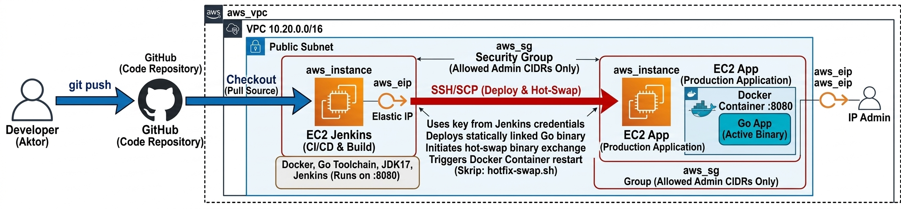

Proyek memakai arsitektur terpisah (*decoupled*) demi keamanan dan isolasi beban kerja.

| Server | Resource Terraform | Peran | Terpasang otomatis |
|---|---|---|---|
| **Jenkins Server** | `aws_instance.jenkins` | CI/CD *orchestrator*: checkout, unit test, build image, ekstrak binary | Docker CE, Go 1.22.10, OpenJDK 17, Jenkins LTS (systemd; user `jenkins` masuk grup `docker`), git, curl, jq, openssh-client |
| **App Server** | `aws_instance.app` | Target produksi: menjalankan container Go di port 8080 | Docker CE, direktori `/opt/hello-devops/{bin,releases,scripts}` milik user `ubuntu` |

**Komponen yang dibuat Terraform (`infra/terraform/`):**

- **VPC & subnet publik** (`10.20.0.0/16`) + Internet Gateway + route table, agar server bisa mengunduh paket.
- **Security Group Jenkins:** port 22 (SSH) dan 8080 (UI Jenkins) hanya dari IP Anda (`allowed_admin_cidrs`).
- **Security Group App:** port 8080 (aplikasi) ke publik; port 22 hanya dari IP admin dan dari Jenkins SG.
- **Key pair otomatis:** Terraform membuat kunci privat `.pem` di `infra/terraform/generated/hello-devops.pem` dan mengunggah kunci publiknya ke AWS. Kunci privat ini nanti dimasukkan ke Jenkins Credentials.
- **Elastic IP** untuk kedua EC2 agar IP publik tidak berubah saat server di-restart.

**Cara kerja skrip bootstrap (`infra/scripts/`)** — dijalankan AWS sebagai *user-data* saat first boot:

1. `bootstrap-jenkins.sh` → memasang OpenJDK 17 dan repositori resmi Jenkins; memasang Docker Engine dan memasukkan user `jenkins` ke grup `docker` (agar `docker build` jalan tanpa `sudo`); memasang Go; menyimpan `APP_SERVER_HOST` (IP *private* App Server) sebagai variabel global Jenkins.
2. `bootstrap-app.sh` → memasang Docker Engine dan membuat direktori target `/opt/hello-devops/bin` milik user `ubuntu`.

Log bootstrap ada di `/var/log/bootstrap.log` pada masing-masing server.

## 2. Prasyarat

| Tool | Cek |
|---|---|
| Git | `git --version` |
| Terraform ≥ 1.5 | `terraform version` ([unduh](https://developer.hashicorp.com/terraform/install)) |
| AWS CLI v2 | `aws --version` |
| Akun AWS + IAM user | izin EC2 & VPC (cukup `AmazonEC2FullAccess` + `AmazonVPCFullAccess` untuk uji coba) |
| Docker | hanya untuk mesin uji Bagian I–II (lihat README) |

## 3. Credential AWS

```bash
aws configure                  # isi Access Key, Secret Key, region ap-southeast-1, output json
aws sts get-caller-identity    # harus menampilkan akun Anda
```

## 4. Variabel Terraform

Dari terminal lokal Anda:

```bash
cd infra/terraform
cp terraform.tfvars.example terraform.tfvars      # Windows CMD: copy terraform.tfvars.example terraform.tfvars
```

Cek IP publik Anda, lalu isikan ke `terraform.tfvars`:

```bash
curl -s https://checkip.amazonaws.com
```

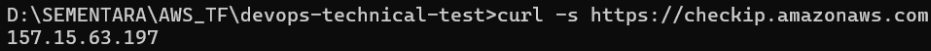

```hcl
aws_region          = "ap-southeast-1"
allowed_admin_cidrs = ["<IP-ANDA>/32"]     # ganti dengan IP publik Anda
```

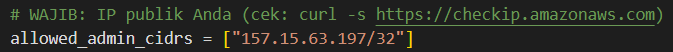

> ⚠️ Bila IP internet Anda berubah (ganti jaringan/WiFi), SSH dan Jenkins UI akan terblokir. Perbarui `allowed_admin_cidrs` lalu `terraform apply` lagi.

## 5. Terraform init, plan, apply

```bash
# 1. Unduh provider (aws, tls, local)
terraform init

# 2. Validasi sintaks lalu pratinjau resource
terraform validate
terraform plan

# 3. Buat infrastruktur di AWS
terraform apply -auto-approve
```

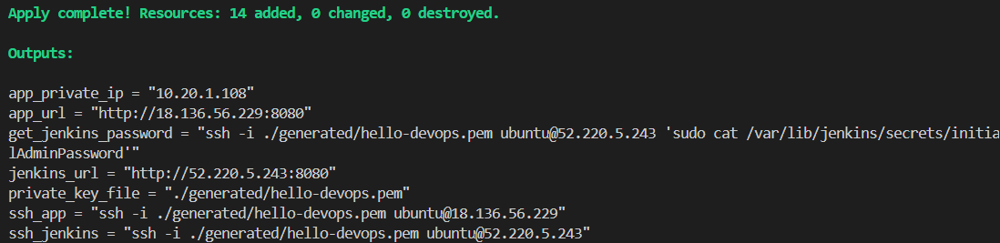

Bila berhasil, muncul `Apply complete! Resources: 14 added, 0 changed, 0 destroyed.` beserta *outputs*:

| Output | Isi |
|---|---|
| `jenkins_url` | `http://<IP-Jenkins>:8080` |
| `app_url` | `http://<IP-App>:8080` (aktif setelah pipeline pertama sukses) |
| `app_private_ip` | IP private App Server (tujuan deploy dari Jenkins) |
| `ssh_jenkins` / `ssh_app` | perintah SSH siap pakai |
| `private_key_file` | lokasi file `.pem` |
| `get_jenkins_password` | perintah mengambil password awal Jenkins |

Verifikasi di AWS Console (**EC2 → Instances**) bahwa dua instance berstatus *Running*:

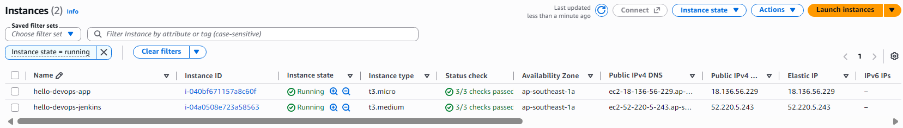

## 6. Permission File Kunci `.pem`

SSH menolak kunci privat yang bisa dibaca user lain. Atur izin file `generated/hello-devops.pem` sesuai OS Anda.

**Windows – Command Prompt (CMD):**
```cmd
icacls .\generated\hello-devops.pem /inheritance:r /grant:r "%USERNAME%:(F)"
```

**Windows – PowerShell:**
```powershell
icacls .\generated\hello-devops.pem /inheritance:r /grant:r "${env:USERNAME}:(F)"
```

**Linux / WSL / macOS / Git Bash:**
```bash
chmod 400 ./generated/hello-devops.pem
```

> Nama file yang benar adalah `hello-devops.pem` (sesuai `private_key_file` pada output Terraform).

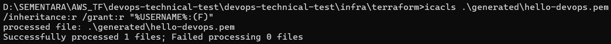

## 7. SSH & Verifikasi Bootstrap

Tunggu **±5–8 menit** setelah `apply` agar skrip bootstrap selesai, lalu masuk ke Jenkins Server:

```bash
ssh -i ./generated/hello-devops.pem ubuntu@<IP-JENKINS>
```


Pantau/cek bootstrap dan tools:

```bash
# Di Jenkins Server
tail -n 20 /var/log/bootstrap.log          # akhir log: "BOOTSTRAP SELESAI"
ls /var/lib/bootstrap.done
docker --version; go version; java -version 2>&1 | head -1
systemctl is-active jenkins
id jenkins                                  # harus ada grup docker
```

```bash
# Di App Server
ssh -i ./generated/hello-devops.pem ubuntu@<IP-APP> \
  'docker --version; systemctl is-active docker; ls -ld /opt/hello-devops'
```


## 8. Unlock Jenkins

1. Ambil password awal (jalankan perintah dari output `get_jenkins_password`, atau langsung di server):
   ```bash
   sudo cat /root/jenkins-initial-admin-password.txt
   # setara dengan:
   sudo cat /var/lib/jenkins/secrets/initialAdminPassword
   ```
2. Buka `http://<IP-JENKINS>:8080`, tempel password.
3. Pilih **Install suggested plugins** dan tunggu semua indikator selesai.
4. Buat akun admin utama.

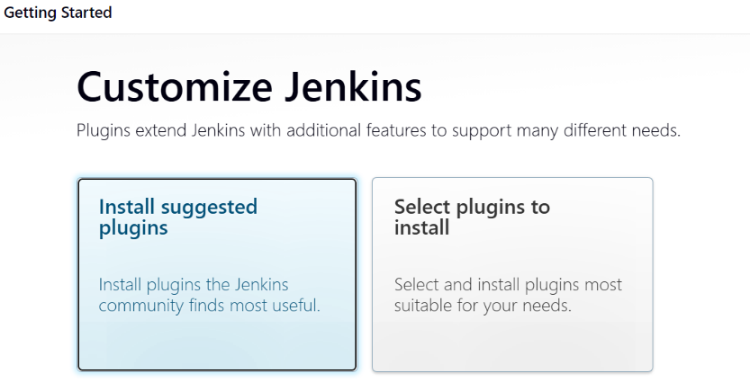

Infrastruktur kini **100% siap**: Jenkins Server dan App Server saling terhubung di dalam VPC.

## 9. Push Proyek ke GitHub

Dari folder utama proyek:

```bash
git init
git add .
git commit -m "Initial commit: Full project DevOps technical test"
git branch -M main
git remote add origin https://github.com/kanjeeng/devops-technical-test-jenkins.git
git push -u origin main
```

Verifikasi di halaman GitHub bahwa folder `app`, `cicd`, `infra`, `docs`, dan `image` terlihat di branch `main`.

Lalu undang penguji: **Settings → Collaborators → Add people** → `admin@simplejourney.co.id`, kemudian kirim link repo.

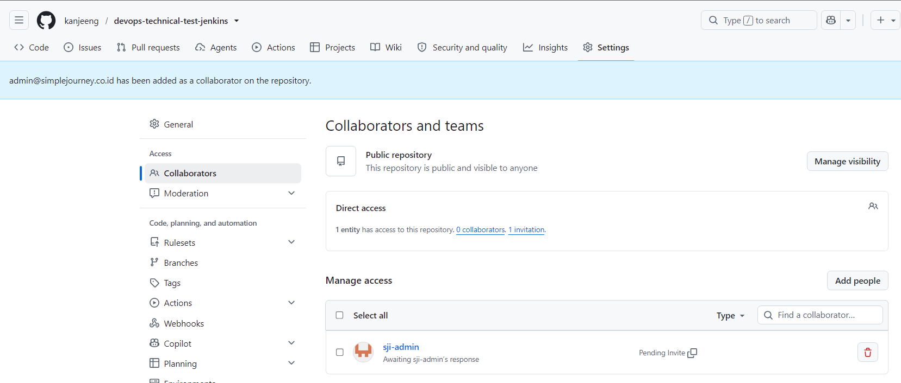

## 10. Credentials, Job, dan Build Pertama

> Penjelasan tiap stage pipeline dan jawaban rollback ada di README Bagian III (disusun pada sesi berikutnya).

**a. SSH credential**

**Manage Jenkins → Credentials → System → Global credentials (unrestricted) → Add Credentials**
- Kind: **SSH Username with private key**
- ID: `app-server-ssh`
- Username: `ubuntu`
- Private Key → **Enter directly** → tempel seluruh isi `generated/hello-devops.pem` (termasuk baris `BEGIN`/`END`)
- **Create**

*(Opsional – push registry)* Kind **Username with password**, ID `registry-credentials`.

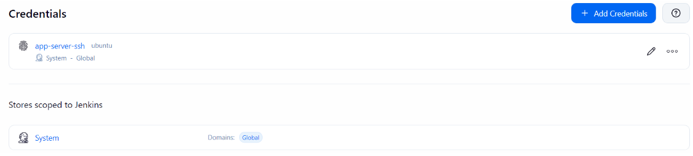

**b. Job Pipeline**

1. **New Item** → nama `hello-devops` → tipe **Pipeline** → OK.
2. Bagian **Pipeline**: Definition **Pipeline script from SCM** → SCM **Git** → URL `https://github.com/kanjeeng/devops-technical-test-jenkins.git`.
3. Branch to build: `*/main` · **Script Path: `cicd/Jenkinsfile`** → **Save**.

> Pastikan variabel global `APP_SERVER_HOST` ada di **Manage Jenkins → System → Global properties → Environment variables** (diisi otomatis oleh bootstrap). Jika kosong, isi parameter `APP_HOST` dengan output `app_private_ip` saat build.

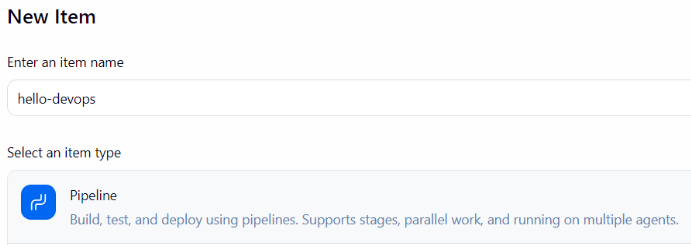

**c. Build pertama**

1. Klik **Build Now** (build pertama membuat parameter pipeline).
2. Untuk build berikutnya pilih **Build with Parameters → Build**.
3. Amati **Stage View** sampai semua stage hijau.

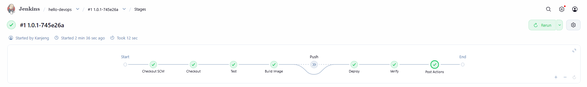

## 11. Verifikasi & Demo

```bash
curl http://<IP-APP>:8080/        # Hello, DevOps! version=1.0.<build>-<commit>
```

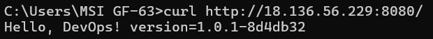

## 12. Demo Hotfix Zero-Downtime Lewat Pipeline

Bagian ini mendemonstrasikan cara melakukan pembaruan kode secara instan (*hotfix*) tanpa menghentikan atau menghapus *container* yang sedang berjalan.

**A. Kondisi Awal (Before Hotfix)**

Sebelum melakukan perubahan, lakukan pengecekan pada App Server untuk melihat versi aplikasi yang sedang aktif serta status *container*-nya:

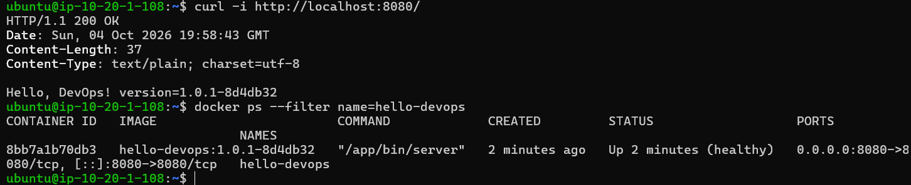

**B. Ubah Teks di `app/main.go` dan `app/main_test.go`**

Buka proyek di editor kode Anda, lalu lakukan penyesuaian teks pada file utama aplikasi dan file pengujiannya.

***1. File `app/main.go`:***

```go
// Ubah baris pemanggilan string respons menjadi:
fmt.Fprintf(w, "Hello, DevOps! Ini Hotfix! version=%s\n", version)

```

***2. File `app/main_test.go`:***

```go
// Sesuaikan ekspektasi unit test agar selaras dengan output baru:
want := "Hello, DevOps! Ini Hotfix! version=9.9.9-test"

```

**C. Commit, Push, dan Build Now di Jenkins**

Kirimkan perubahan kode tersebut ke repositori GitHub Anda:

```bash
git add app/main.go app/main_test.go
git commit -m "feat: demo hotfix zero-downtime lewat pipeline"
git push origin main

```

Setelah itu, buka dashboard **Jenkins**, masuk ke job `hello-devops`, lalu klik **Build Now** dan tunggu hingga seluruh *stage* pipeline selesai dengan status sukses (*SUCCESS*).

**D. Verifikasi Hasil Akhir (After Hotfix)**

Masuk kembali ke terminal App Server, lalu jalankan perintah verifikasi:

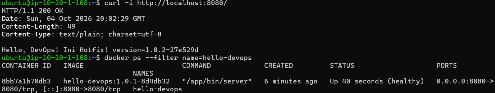

---

## Analisis Teknis Demo Hotfix

Dari hasil pengujian di atas, kita dapat menarik beberapa poin analisis penting:

* **Container ID Tetap Sama:** ID *container* (`8bb7a1b70db3`) tidak berubah sama sekali. Kolom `CREATED` menunjukkan waktu pembuatan awal (misal: 6 menit yang lalu), sedangkan kolom `STATUS` menunjukkan waktu *restart* yang baru (misal: `Up 40 seconds`). Ini membuktikan bahwa Jenkins tidak membuat *container* baru dari awal.


* **Versi Berubah & Pesan Terperbarui:** Respons dari `curl` berhasil menampilkan teks `Ini Hotfix!` disertai hash *commit* atau nomor versi terbaru (`1.0.2-27e529d`).


* **Downtime Minimal (±1–2 Detik):** Karena arsitektur menggunakan *Volume Mount* Docker (`-v /opt/hello-devops/bin:/app/bin:ro`), proses *deploy* di belakang layar hanya bertindak menimpa file *binary* baru ke direktori *host* secara atomik, lalu memicu perintah `docker restart` kilat. Hal ini memangkas waktu pembaruan sistem secara drastis tanpa proses *build image* ulang di sisi server produksi.

## 13. Bersihkan Resource

```bash
cd infra/terraform
terraform destroy
```

## Menjalankan Skrip Bootstrap Manual (tanpa Terraform)

Di Ubuntu 22.04 baru:

```bash
sudo bash -c 'source infra/scripts/common.sh && source infra/scripts/bootstrap-app.sh'
sudo bash -c 'export APP_SERVER_HOST=10.20.1.x; source infra/scripts/common.sh && source infra/scripts/bootstrap-jenkins.sh'
```

---
